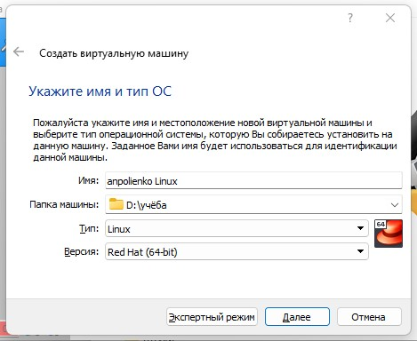
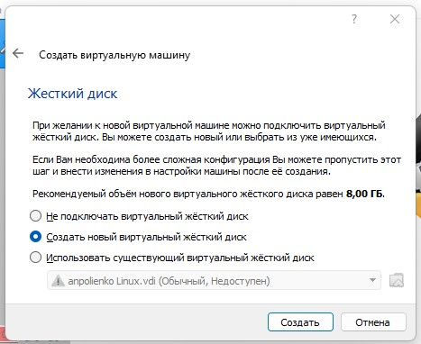
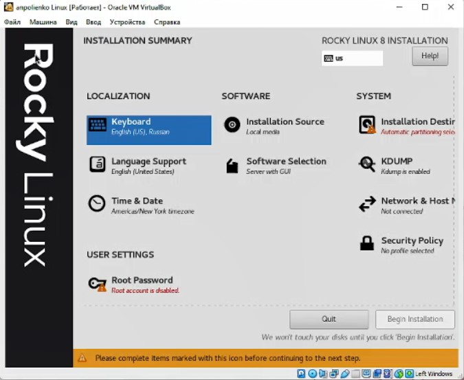
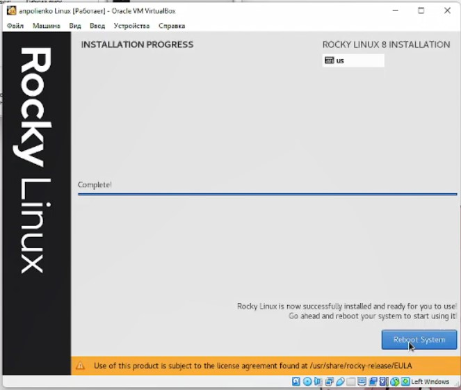
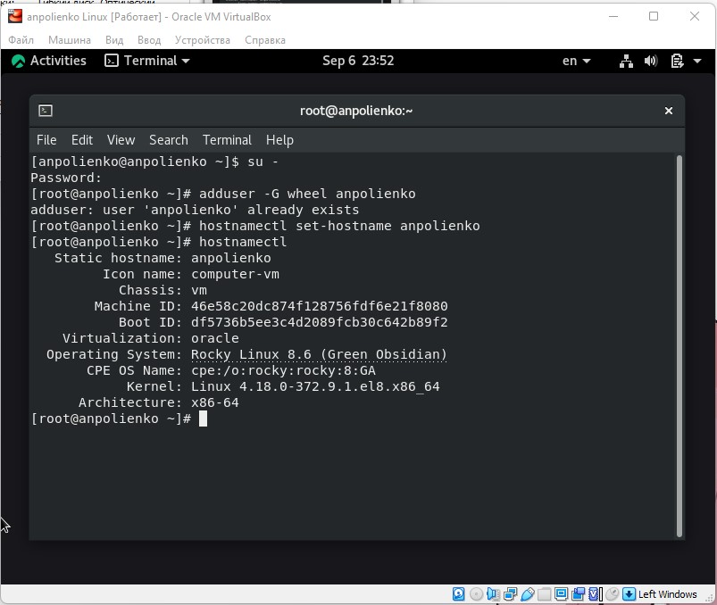

---
## Front matter
lang: ru-RU
title: Лабораторная работа №1
subtitle: Основы информационной безопасности
author:
  - Полиенко Анастасия Николаевна
institute:
  - Российский университет дружбы народов, Москва, Россия
  - НПМбд-01-19
date: 08 сентября 2022

## i18n babel
babel-lang: russian
babel-otherlangs: english

## Formatting pdf
toc: false
toc-title: Содержание
slide_level: 2
aspectratio: 169
section-titles: true
theme: metropolis
header-includes:
 - \metroset{progressbar=frametitle,sectionpage=progressbar,numbering=fraction}
 - '\makeatletter'
 - '\beamer@ignorenonframefalse'
 - '\makeatother'
---

# Установка OC Linux на виртуальную машину

## Цель лабораторной работы

- Ознакомиться с процессом установки OC Linux на виртуальную машину
- Настроить минимально необходимые сервисы для дальнейшей работы

## Задачи лабораторной работы

- Установить Oracle VM VirtualBox
- Настроить виртуальную машину
- Установить Linux Rocky 

# Ход выполнения лабораторной работы

## Создание виртуальной машины

Создаём виртуальную машину и выбираем версию OC Red Hat (64-bit)

## Создание жёсткого диска

Создаём новый виртуальный динамический жёсткий диск VDI на 20 ГБ

## Настройка виртуальной машины

Запускаем виртуальную машину и настраиваем нужные параметры, такие как
язык, клавиатура, сетевое соединение и администратора.

## Завершение установки

Запускаем установку ОС, после чего перезапускаем виртуальную машину и принимаем
условия лицензии.

## Работа с консолью

Дожидаемся загрузки системы и открываем консоль. Там можно создать пользователя и
установить пароль, а также поменять имя хоста.

## Выводы

- Приобрела практические навыки установки виртуальной машины
- Научилась настраивать OC Linux и минимально необходимых сервисов
