---
## Front matter
title: "Отчёт по лабораторной работе №1"
subtitle: "Дисциплина: Основы информационной безопасности"
author: "Полиенко Анастасия Николаевна, НПМбд-01-19"

## Generic otions
lang: ru-RU
toc-title: "Содержание"

## Bibliography
bibliography: bib/cite.bib
csl: pandoc/csl/gost-r-7-0-5-2008-numeric.csl

## Pdf output format
toc: true # Table of contents
toc-depth: 2
lof: true # List of figures
fontsize: 12pt
linestretch: 1.5
papersize: a4
documentclass: scrreprt
## I18n polyglossia
polyglossia-lang:
  name: russian
  options:
	- spelling=modern
	- babelshorthands=true
polyglossia-otherlangs:
  name: english
## I18n babel
babel-lang: russian
babel-otherlangs: english
## Fonts
mainfont: PT Serif
romanfont: PT Serif
sansfont: PT Sans
monofont: PT Mono
mainfontoptions: Ligatures=TeX
romanfontoptions: Ligatures=TeX
sansfontoptions: Ligatures=TeX,Scale=MatchLowercase
monofontoptions: Scale=MatchLowercase,Scale=0.9
## Biblatex
biblatex: true
biblio-style: "gost-numeric"
biblatexoptions:
  - parentracker=true
  - backend=biber
  - hyperref=auto
  - language=auto
  - autolang=other*
  - citestyle=gost-numeric
## Pandoc-crossref LaTeX customization
figureTitle: "Рис."
tableTitle: "Таблица"
listingTitle: "Листинг"
lofTitle: "Список иллюстраций"
lotTitle: "Список таблиц"
lolTitle: "Листинги"
## Misc options
indent: true
header-includes:
  - \usepackage{indentfirst}
  - \usepackage{float} # keep figures where there are in the text
  - \floatplacement{figure}{H} # keep figures where there are in the text
---

# Цель работы

Ознакомится с процессом установки OC Linux на виртуальную машину и настроить минимально 
необходимые данные для дальнейшей работы.

# Выполнение лабораторной работы

## Создание виртуальной машины и настройка ОС

Для создания виртуальной машины используем программу Oracle VM VirtualBox. Для начала нужно настроить 
месторасположение виртуальной машины (рис. [-@fig:001])

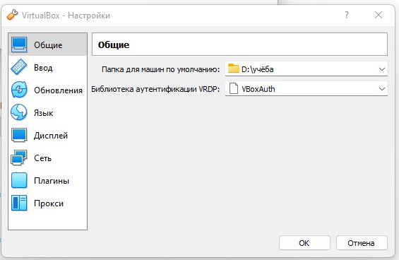{ #fig:001 width=70% }

Создаём виртуальную машину с помощью кнопки "Создать", вводим имя виртуальной машины и выбираем версию ОС,
в данном случае Red Hat (64-bit) (рис. [-@fig:002])

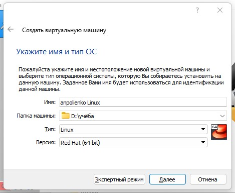{ #fig:002 width=70% }

Затем устанавливаем объем оперативной памяти --- 2048 МБ (рис. [-@fig:003])

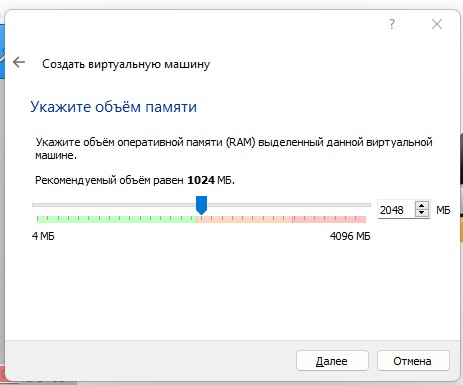{ #fig:003 width=70% }

Создаём новый виртуальный жёсткий диск (рис. [-@fig:004])

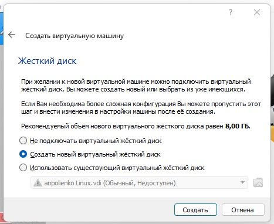{ #fig:004 width=70% }

Выбираем тип жёсткого диска как VDI (рис. [-@fig:005])

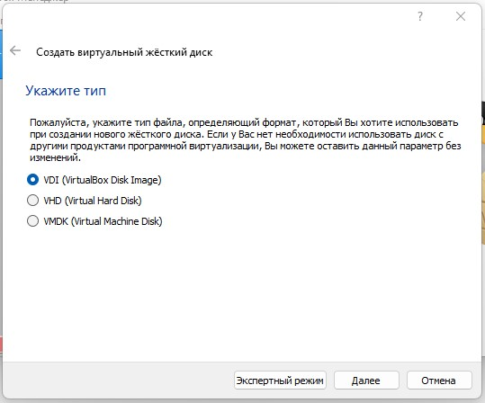{ #fig:005 width=70% }

И указываем формат хранения как динамический виртуальный жёсткий диск (рис. [-@fig:006])

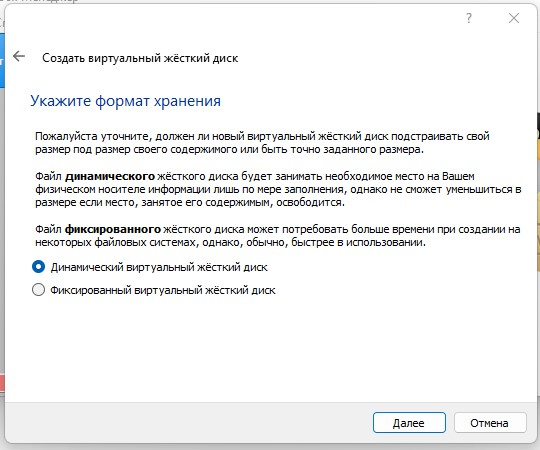{ #fig:006 width=70% }

А также назначаем размер жёсткого диска --- 20 ГБ (рис. [-@fig:007])

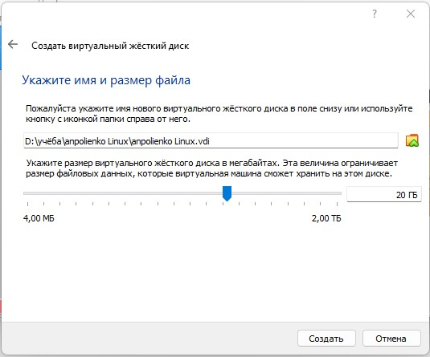{ #fig:007 width=70% }

Настраиваем виртуальную машину. В разделе "Носители" выбираем новый оптический диск, в данном случае это
Rocky-8.6-x86_64-dvd1.iso (рис. [-@fig:008])

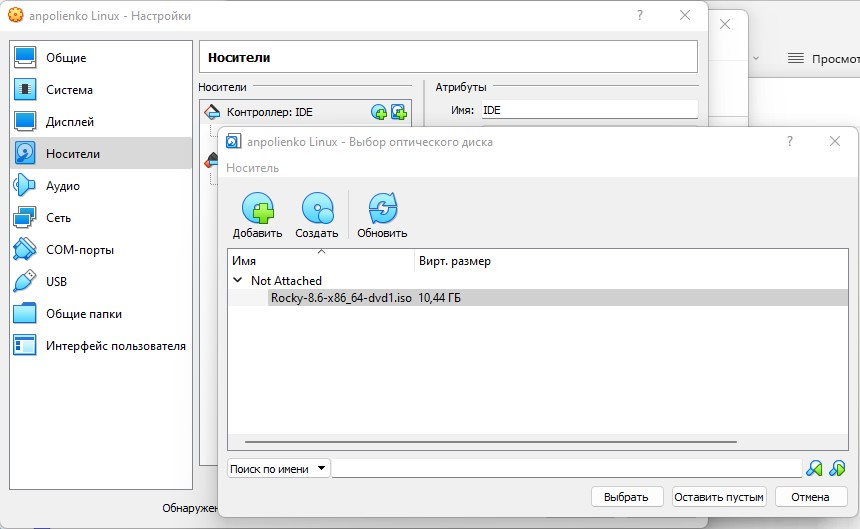{ #fig:008 width=70% }

Запускаем виртуальную машину (рис. [-@fig:009])

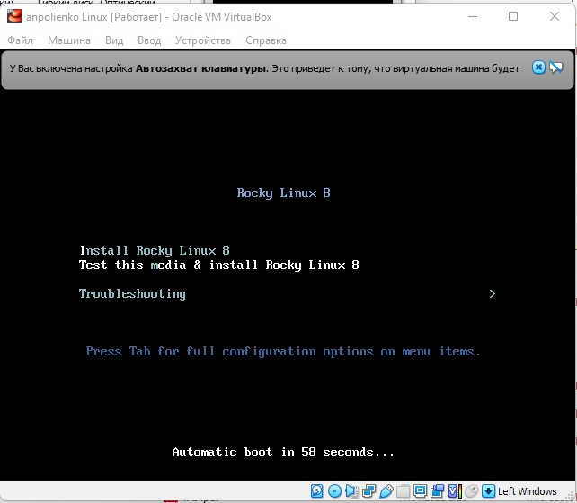{ #fig:009 width=70% }

Настраиваем язык, я выбрала оставить английский (рис. [-@fig:010])

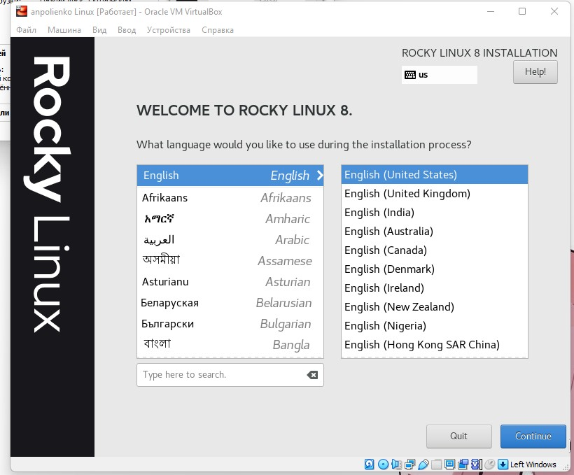{ #fig:010 width=70% }

Настраиваем клавитуру. Добавляем русскую раскладку и делаем смену языка через сочетание клавиш Alt+Shift (рис. [-@fig:011])

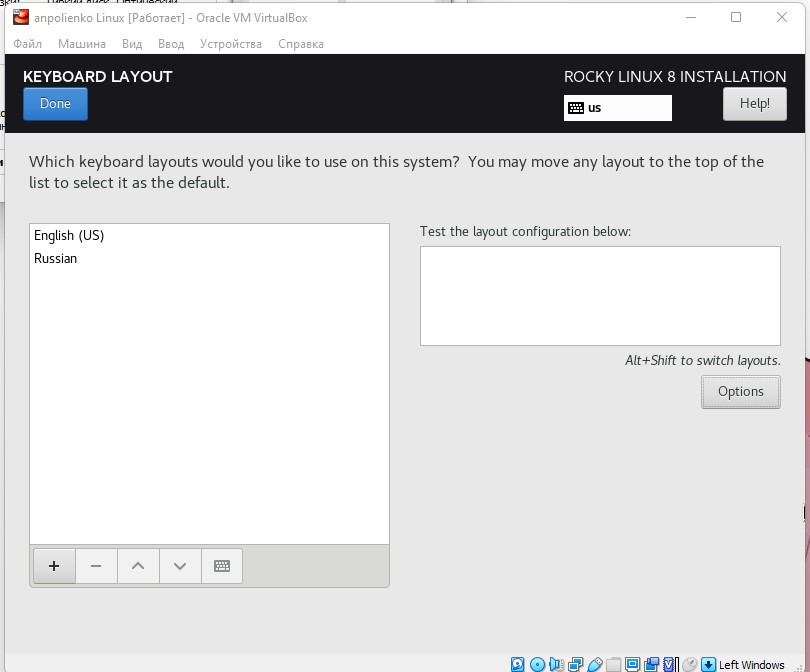{ #fig:011 width=70% }

В разделе выбора программ добавляем в качестве дополнения Development Tools (рис. [-@fig:012])

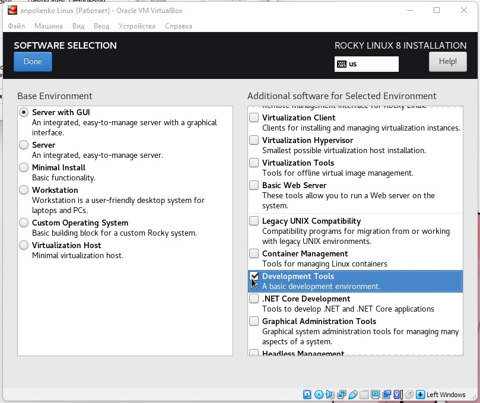{ #fig:012 width=70% }

Отключаем KDUMP (рис. [-@fig:013])

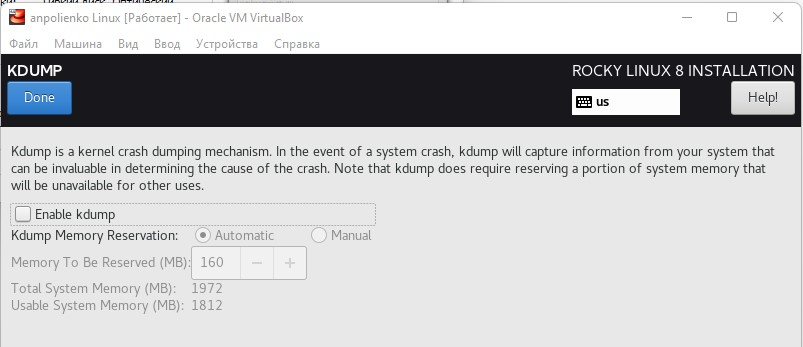{ #fig:013 width=70% }

Подключаем сетевое соединение и устанавлием имя узла (рис. [-@fig:014])

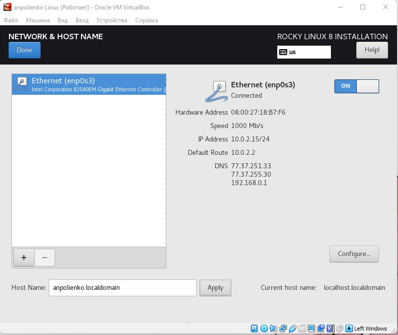{ #fig:014 width=70% }

Устанавливаем пароль для root и администратора (рис. [-@fig:015])

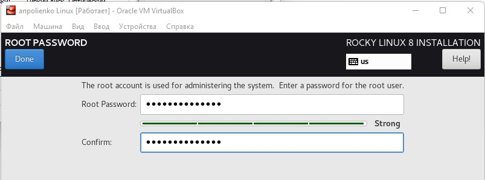{ #fig:015 width=70% }

Создаём пользователя с правами администратора (рис. [-@fig:016])

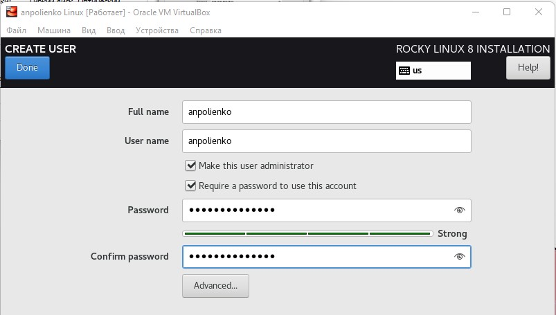{ #fig:016 width=70% }

Далее запускаем установку ОС, после завершения этого процесса перезапускаем систему 
и принимаем условия лицензии (рис. [-@fig:017])

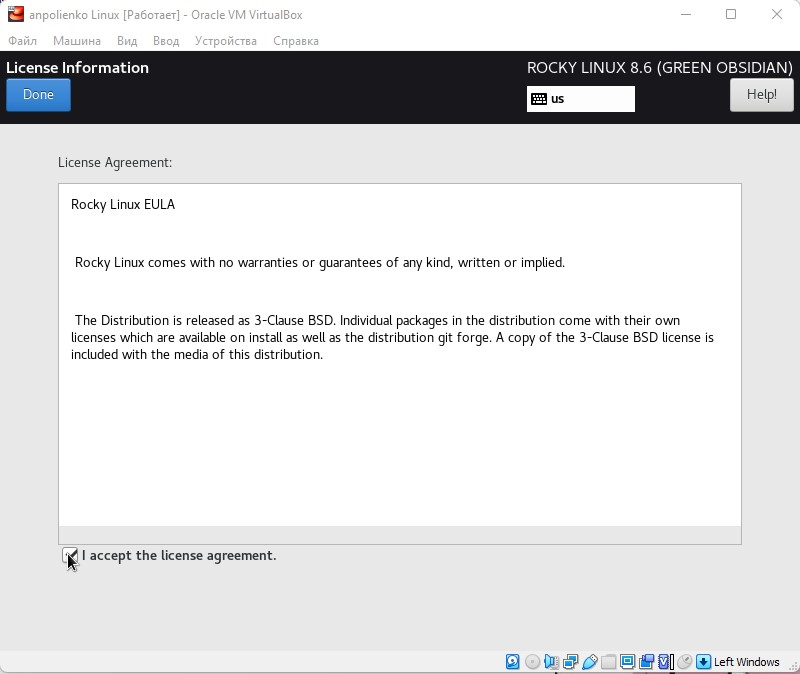{ #fig:017 width=70% }

Дожидаемся загрузки системы и открываем консоль. Через неё устанавливаем имя хоста 
командой hostnamectl (рис. [-@fig:018])

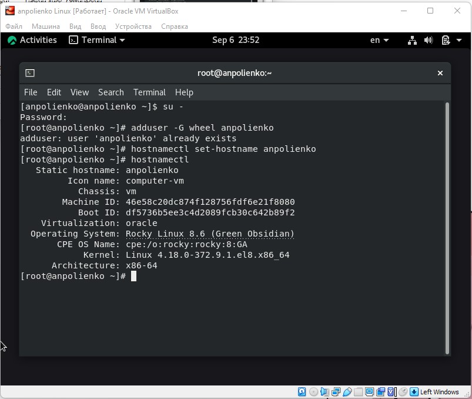{ #fig:018 width=70% }

## Домашнее задание

С помощью команды dsmeg узнаем данные о нашей системе (рис. [-@fig:019])

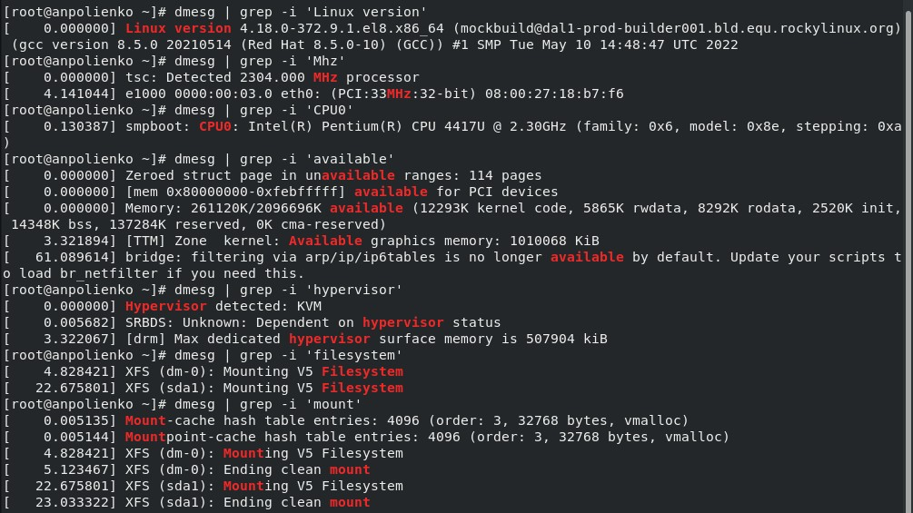{ #fig:019 width=70% }

1. Версия ядра Linux --- 4.18.0-372.9.1.el8.x86_64
1. Частота процессора --- 2304 МГц
1. Модель процессора --- Intel(R) Pentium(R) CPU 4417U
1. Объём доступной оперативной памяти --- 2096696 Кбайт
1. Тип обнаруживаемого гипервизора --- KVM
1. Тип файловой системы корневого раздела --- XFS
1. Последовательность монтирования файловых систем находится через команду dsmeg | grep -i "mount"

# Выводы

Установила на виртуальную машину OC Linux, настроила её и получила основную информацию о системе через консоль.

# Контрольные вопросы

1. Учётная запись пользователя содержит сведения, необходимые для идентификации пользователя при подключении к системе,
такие как имя пользователя, имя хоста и пароль.
1. Команды терминала:
	1. Для получения справки используется ключ --help или команда man. Например, ls --help или man ls.
	1. Для перемещения по файловой системе используется команда cd. Например cd ~.
	1. Для просмотра содержимого каталога используется команда ls. Например ls ~/work.
	1. Для определения объёма каталога используется команда du. 
	1. Для создания каталогов используется mkdir, для удаления пустых каталогов используется rmdir. Для создания файлов
используется touch, для удаления файлов и каталог используется rm.
	1. Для задания прав используется команда chmod. Например, chmod u-w test.txt.
	1. Для просмотра истории команд используется команда history.
1. Файловая система --- часть ОС, которая обеспечивает чтение и запись файлов на дисковых носителях информации.
	1. Ext2 --- расширенная файловая система. Данные сначала кэшируются и только потом записываются на диск.
	1. Ext3 и Ext4 --- журналируемые файловые системы. Осуществляется хранение в виде журнала со списком изменений, что
помогает сохранить целостность при сбоях.
	1. XFS --- высокопроизводительная журналируемая файловая система, рассчитанная для работы на дисках большого объёма.
1. Для просмотра подмонтированных в ОС файловых систем необходимо использовать команду findmht.
1. Для удаления зависшего процесса используется команда kill *PID* или killall *название*.
