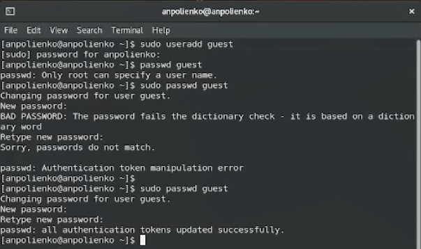
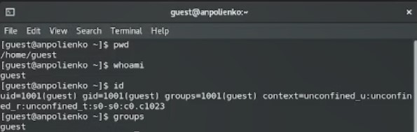
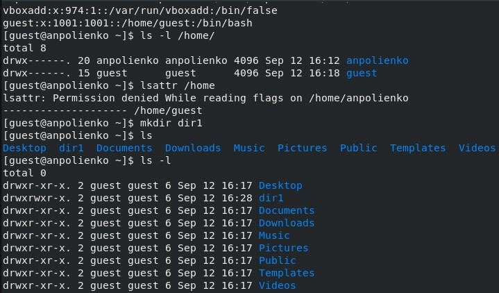
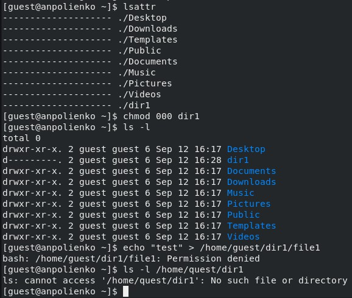
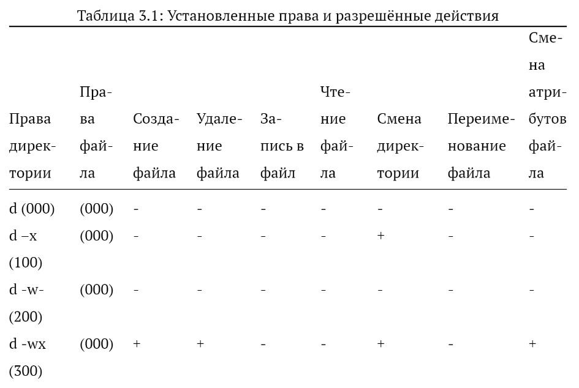

---
## Front matter
lang: ru-RU
title: Лабораторная работа №2
subtitle: Основы информационной безопасности
author:
  - Полиенко Анастасия Николаевна
institute:
  - Российский университет дружбы народов, Москва, Россия
  - НПМбд-01-19
date: 14 сентября 2022

## i18n babel
babel-lang: russian
babel-otherlangs: english

## Formatting pdf
toc: false
toc-title: Содержание
slide_level: 2
aspectratio: 169
section-titles: true
theme: metropolis
header-includes:
 - \metroset{progressbar=frametitle,sectionpage=progressbar,numbering=fraction}
 - '\makeatletter'
 - '\beamer@ignorenonframefalse'
 - '\makeatother'
---

# Дискреционное разграничение прав в Linux. Основные атрибуты

## Цель лабораторной работы

- Получить навыки работы с атрибутами файлов через консоль
- Изучить влияние атрибутов на различные действия

## Задачи лабораторной работы

- Создать нового пользователя
- От его лица изучить основные команды для работы с атрибутами
- На конкретной директории и файле изучить влияние атрибутов

# Ход выполнения лабораторной работы

## Создание нового пользователя

Создаём нового пользователя с помощью команды useradd и устанавливаем для него пароль командой passwd.

## Проверка данных пользователя

Заходим в систему от имени пользователя guest, узнаём его uid и группы, в которых он состоит, с помощью команды id.

## Просмотр атрибутов

- Просмотр атрибутов осуществляется командой ls -l. 
- Просмот расширенных атрибутов осуществляется командой lsattr.

## Смена прав доступа

Смена основных атрибутов осуществляется с помощью команды chmod.

## Разрешённые действия

Изменяя атрибуты директории dir1 и файла file1 в этой директории, получаем таблицу с действиями, которые можно и нельзя
осуществлять с определённой конбинацией прав доступа.

## Минимальные требования

На основе полученных данных узнаём минимально необходимые права для осуществления тех или иных действий над файлом и директорией.

## Выводы 

- Приобрела практические навыки по работе с атрибутами файлов и директорий в консоли
- Изучила и нашла минимальные права доступа, необходимые для работы с файлами и директориями
