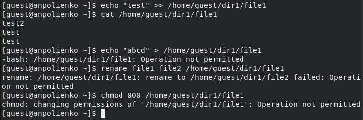

---
## Front matter
title: "Отчёт по лабораторной работе №4"
subtitle: "Дисциплина: Основы информационной безопасности"
author: "Полиенко Анастасия Николаевна, НПМбд-01-19"

## Generic otions
lang: ru-RU
toc-title: "Содержание"

## Bibliography
bibliography: bib/cite.bib
csl: pandoc/csl/gost-r-7-0-5-2008-numeric.csl

## Pdf output format
toc: true # Table of contents
toc-depth: 2
lof: true # List of figures
fontsize: 12pt
linestretch: 1.5
papersize: a4
documentclass: scrreprt
## I18n polyglossia
polyglossia-lang:
  name: russian
  options:
	- spelling=modern
	- babelshorthands=true
polyglossia-otherlangs:
  name: english
## I18n babel
babel-lang: russian
babel-otherlangs: english
## Fonts
mainfont: PT Serif
romanfont: PT Serif
sansfont: PT Sans
monofont: PT Mono
mainfontoptions: Ligatures=TeX
romanfontoptions: Ligatures=TeX
sansfontoptions: Ligatures=TeX,Scale=MatchLowercase
monofontoptions: Scale=MatchLowercase,Scale=0.9
## Biblatex
biblatex: true
biblio-style: "gost-numeric"
biblatexoptions:
  - parentracker=true
  - backend=biber
  - hyperref=auto
  - language=auto
  - autolang=other*
  - citestyle=gost-numeric
## Pandoc-crossref LaTeX customization
figureTitle: "Рис."
tableTitle: "Таблица"
listingTitle: "Листинг"
lofTitle: "Список иллюстраций"
lotTitle: "Список таблиц"
lolTitle: "Листинги"
## Misc options
indent: true
header-includes:
  - \usepackage{indentfirst}
  - \usepackage{float} # keep figures where there are in the text
  - \floatplacement{figure}{H} # keep figures where there are in the text
---

# Цель работы

Получить навыки работы в консоли с расширенными атрибутами файлов.

# Теоретическое введение

Атрибуты --- это набор основных девяти битов, определяющих какие из пользователей обладают правами на чтение, запись
и исполнение. 
Первые три бита отвечают права доступа владельца, вторые --- для группы пользователей, последние --- для всех остальных
пользователей в системе.

Установка атрибутов производится командой chmod. Установка бита чтения (r) позволяет сделать файл доступным для чтения. 
Наличие бита записи (w) позволяет изменять файл. Установка бита запуска (x) позволяет запускать файл на исполнение.
 
Более подробно см. в [@gnu-doc:bash].

Расширенные атрибуты --- это система дополнительной информации, которая может быть добавлена к файлу или директории в файловой системе.

Некоторые примеры расширенных атрибутов:

- а --- файл можно открыть только в режиме добавления.
- А --- при доступе к файлу его запись atime не изменяется.
- с --- файл автоматически сжимается.
- e --- файл использует экстенты.
- E --- файл, каталог или символьная ссылка зашифрованы файловой системой.
- F --- поиски путей в директории выполняются без учёта регистра.
- i --- файл не может быть изменён.
- m --- файл не сжимается.

Более подробно см. в [@gnu-doc-1:bash]

# Выполнение лабораторной работы

От имени пользователя guest просмотрим расширенные атрибуты файла file1 с помощью команды lsattr. Далее изменим права на этот файл с помощью команды chmod 600 file1, сделав его доступным только для чтения и записи. После этого при попытке добавить расширенный атрибут с помощью команды chattr мы получаем сообщение об ошибке (рис. [-@fig:001]).

{ #fig:001 width=70% }

От имени администратора в другой консоли добавляем файлу file1 аттрибут a командой chattr +a. Убеждаемся в корректном установлении атрибута с помощью команды lsattr (рис. [-@fig:002]).

{ #fig:002 width=70% }

Дозаписываем в конец файла новую информацию с помощью команды echo >> и проверяем, что это действительно произошло, командой cat. Далее пытаемся стереть информацию в файле с помощью команды echo >, на что получаем ошибку. Также не удаётся переименовать файл и изменить его атрибуты командой chmod из-за той же ошибки в правах доступа (рис. [-@fig:003]).

{ #fig:003 width=70% }

Снимаем расширенный атрибут a командой chattr -a от лица администратора. При повторе ранее описанных действий теперь не произошло ошибок и они все выполнились (рис. [-@fig:004]).

{ #fig:004 width=70% }

От имени адмистратора добавим файлу расширенный атрибут i и повторим ранее описанные действия. По итогу получаем, что в этом случае файл можно только читать, но нельзя никак изменить. (рис. [-@fig:005]).

{ #fig:005 width=70% }

# Выводы

Приобрела практические навыки работы с расширенными атрибутами файлов через консоль, опробовала на практике действия с файлами с установленными на них расширенными атрибутами a и i

# Список литературы{.unnumbered}

::: {#refs}
:::
