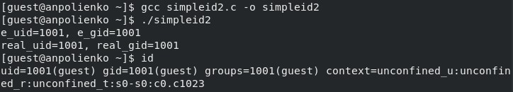
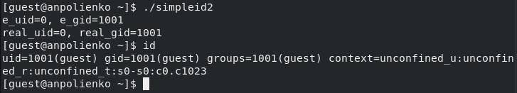
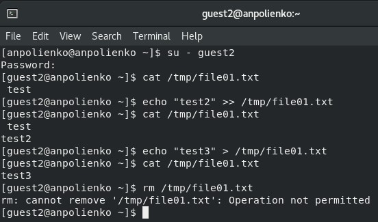

---
## Front matter
lang: ru-RU
title: Лабораторная работа №5
subtitle: Основы информационной безопасности
author:
  - Полиенко Анастасия Николаевна
institute:
  - Российский университет дружбы народов, Москва, Россия
  - НПМбд-01-19
date: 23 сентября 2022

## i18n babel
babel-lang: russian
babel-otherlangs: english

## Formatting pdf
toc: false
toc-title: Содержание
slide_level: 2
aspectratio: 169
section-titles: true
theme: metropolis
header-includes:
 - \metroset{progressbar=frametitle,sectionpage=progressbar,numbering=fraction}
 - '\makeatletter'
 - '\beamer@ignorenonframefalse'
 - '\makeatother'
---

# Дискреционное разграничение прав в Linux. Исследование влияния дополнительных атрибутов

## Цель лабораторной работы

- Изучить особенности работы с дополнительными атрибутами SetUID, SetGID и Sticky.
- Изучить механизмы изменения идентификаторов.

## Задачи лабораторной работы

- Создать программу, выводящую uid и gid, и посмотреть на вывод после добавления SetUID и SetGID битов.
- Создать программу для чтения файлов и проверить вывод после добавления SetUID бита.
- На примере папки /tmp изучить влияние Sticky бита на запись и удаление файлов.

# Ход лабораторной работы

## Создание файла

Создаём файл simpleid2.c, который будет выводить uid и gid. При отсутствии дополнительных битов, она выводит информацию, совпадающую с выводом команды id.

## Установка SetUID-бита

С помощью команды chown меняем владельца файла на root и устанавливаем SetUID командой chmod u+s.

## Запуск simpleid2

После запуска видим, что uid сменилось на 0 (для root), в то время как в команде id uid всё ещё остался 1001.

## Установка SetGID-бита

С помощью команды chown меняем группу для файла и устанавливаем SetGID командой chmod g+s. Видим, что при запуске программы изменился вывод gid.

## Наличие Sticky-бита

Проводим над файлом file01.txt следующие действия: читаем его, дозаписываем и перезаписываем информацию, переименовываем. Эти действия проходят без ошибок. При попытке удаления возникает ошибка.

## Изменение Sticky-бита

От имени суперпользователя удаляем sticku-бит командой chmod -t.

## Отсутствие Sticky-бита

Повторяем описанные ранее действия над файлом file01.txt. Теперь пользователь может удалить не принадлежащий ему файл.

## Выводы

- Изучила механизмы изменения идентификаторов.
- Получила практические навыки по работе с допольнительными атрибутами.

