---
## Front matter
title: "Отчёт по лабораторной работе №5"
subtitle: "Дисциплина: Основы информационной безопасности"
author: "Полиенко Анастасия Николаевна, НПМбд-01-19"

## Generic otions
lang: ru-RU
toc-title: "Содержание"

## Bibliography
bibliography: bib/cite.bib
csl: pandoc/csl/gost-r-7-0-5-2008-numeric.csl

## Pdf output format
toc: true # Table of contents
toc-depth: 2
lof: true # List of figures
fontsize: 12pt
linestretch: 1.5
papersize: a4
documentclass: scrreprt
## I18n polyglossia
polyglossia-lang:
  name: russian
  options:
	- spelling=modern
	- babelshorthands=true
polyglossia-otherlangs:
  name: english
## I18n babel
babel-lang: russian
babel-otherlangs: english
## Fonts
mainfont: PT Serif
romanfont: PT Serif
sansfont: PT Sans
monofont: PT Mono
mainfontoptions: Ligatures=TeX
romanfontoptions: Ligatures=TeX
sansfontoptions: Ligatures=TeX,Scale=MatchLowercase
monofontoptions: Scale=MatchLowercase,Scale=0.9
## Biblatex
biblatex: true
biblio-style: "gost-numeric"
biblatexoptions:
  - parentracker=true
  - backend=biber
  - hyperref=auto
  - language=auto
  - autolang=other*
  - citestyle=gost-numeric
## Pandoc-crossref LaTeX customization
figureTitle: "Рис."
tableTitle: "Таблица"
listingTitle: "Листинг"
lofTitle: "Список иллюстраций"
lotTitle: "Список таблиц"
lolTitle: "Листинги"
## Misc options
indent: true
header-includes:
  - \usepackage{indentfirst}
  - \usepackage{float} # keep figures where there are in the text
  - \floatplacement{figure}{H} # keep figures where there are in the text
---

# Цель работы

Изучить особенности работы с дополнительными атрибутами SetUID, SetGID и Sticky битами и их влияние на работу с файлами при их наличии и отсутствии.

# Теоретическое введение

SetUID, SetGID и Sticku --- это специальные типы разрешений, которые позволяют задавать расширенные права доступа на файлы и каталоги.

- SetUID --- это бит разрешения, который позволяет пользователю запускать исполняемый файл с правами владельца этого файла. Другими словами, использование этого бита позволят поднять привилегии пользователя в случае, если это необходимо. Наличие SetUID бита выражается в том, что на месте классического бита x выставлен специальный бит s: -rwsr-xr-x
- SetGID --- очень похож на SetUID с отличием, что файл будет запускаться от имени группы, который владеет файлом: -rwxr-sr-x
- Sticky --- в случае, если этот бит установлен для папки, то файлы в этой папке могут быть удалены только их владельцем. Наличие этого бита показывается через букву t в конце всех прав: drwxrwxrwxt

Более подробно см. в [@gnu-doc:bash].

# Выполнение лабораторной работы

## Создание программы

Создадим программу simpleid.c (рис. [-@fig:001]).

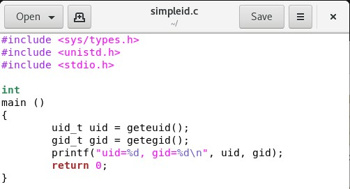{ #fig:001 width=70% }

Скомпилируем программу с помощью команды gcc и убеждаемся, что файл действительно создан. Далее запускаем исполняемый файл через ./. Вывод написанной программы совпадает с выводом команды id (рис [-@fig:002]).

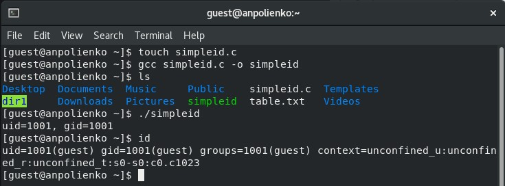{ #fig:002 width=70% }

Усложним программу и назовём её simpleid2.c (рис. [-@fig:003]).

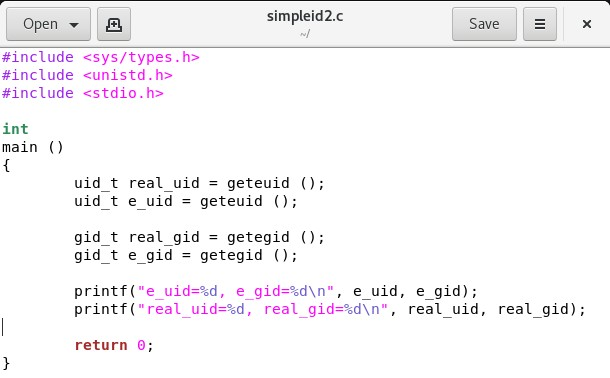{ #fig:003 width=70% }

Скомпилируем и запустим файл simpleid2 (рис. [-@fig:004]).

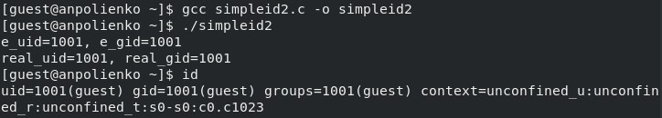{ #fig:004 width=70% }

От имени суперпользователя сменим владельца файла simpleid2 на root и установим SetUID-бит. Далее через команду ls -l видим, что бит установился корректно (рис. [-@fig:005])

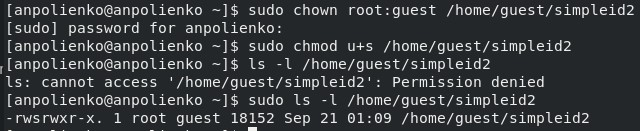{ #fig:005 width=70% }

Запускаем программу simpleid2 и комаду id. Теперь видим, что появились отличия в uid строках (рис. [-@fig:006]).

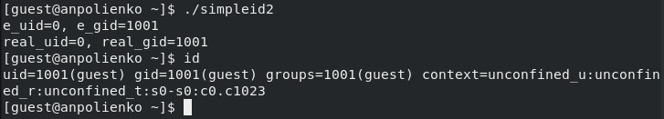{ #fig:006 width=70% }

Проделываем выше описанные действия для SetGID-бита. Теперь после запуска simpleid2 можем увидеть отличие и в gid строках (рис. [-@fig:007]).

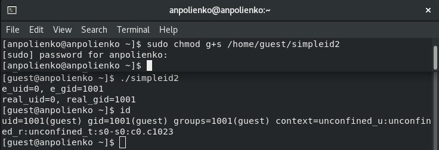{ #fig:007 width=70% }

Создадим программу readfile.c (рис. [-@fig:008]).

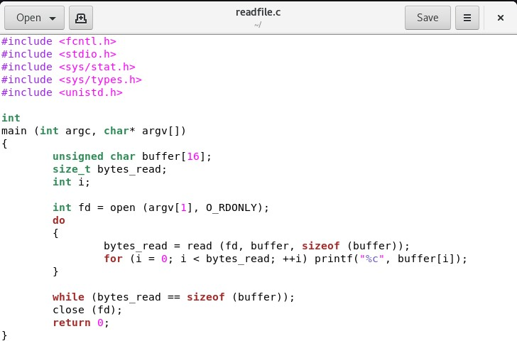{ #fig:008 width=70% }

Откомпилируем эту программу командой gcc. Далее меняем владельца файла readfile.c и отнимаем у пользователя guest право на чтение. При попытке прочитать файл от имени пользователя guest возникает ошибка (рис. [-@fig:009]).

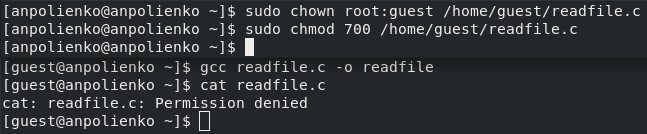{ #fig:009 width=70% }

Меняем владельца файла readfile и устанавливаем на него SetUID-бит. Запускаем исполняемый файл и убеждаемся, что программа может прочитать файлы readfile.c и /etc/shadow (рис. [-@fig:010]).

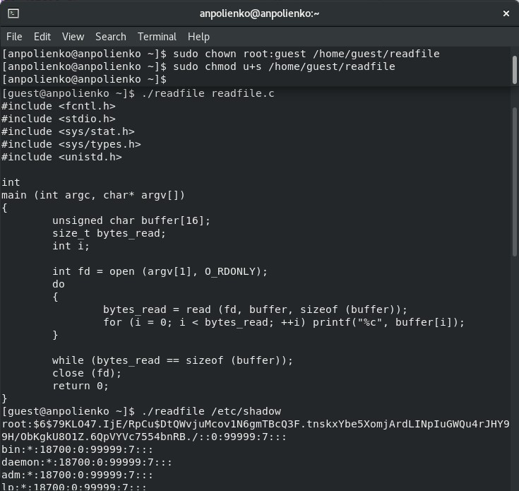{ #fig:010 width=70% }

## Исследование Sticky-бита

Выполняя команду ls -l выявняем, что на каталоге /tmp установлен Sticky-бит. Это видно, т.к. в конце написана t. Далее от имени пользователя guest создаём файл /tmp/file01.txt. Потом просматриваем атрибуты только что созданного файла и даём всем пользователям право на чтение и запись (рис. [-@fig:011]).

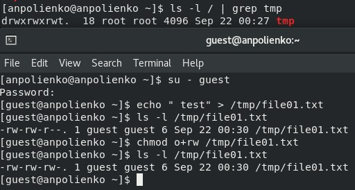{ #fig:011 width=70% }

От имени пользователя guest2 читаем файл file01.txt командой cat. Далее успешно дозаписываем в конец файла строку "test2", а затем успешно перезаписываем содержимое, меняя его на строку "test3". Однако при попытке удалить файл возникла ошибка (рис. [-@fig:012]).

{ #fig:012 width=70% }

Временно повышаем права до суперпользователя и снимаем с директории /tmp Sticky-бит. Покидаем режим суперпользователя командой exit (рис. [-@fig:013]).

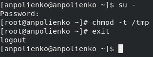{ #fig:013 width=70% }

Убеждаемся через команду ls -l, что Sticky-бит действительно отсутсвует. Далее повторяем действия от имени пользователя guest2. описанные выше. В этот раз удалось удалить файл file01.txt даже при условии, что guest2 не является его владельцем (рис. [-@fig:014]).

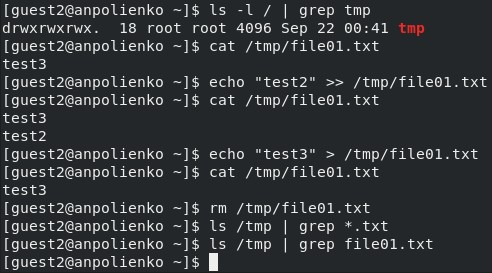{ #fig:014 width=70% }

Временно повышаем права до суперпользователя и возвращает Sticky-бит на каталог /tmp (рис. [-@fig:015]).

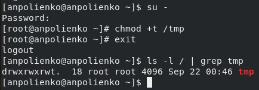{ #fig:015 width=70% }

# Выводы

Изучила механизмы изменения идентификаторов и получила практические навыки по работе с SetUID, SetGID и Sticky битами и узнала об их особенностях и влиянии на файлы и директории.

# Список литературы{.unnumbered}

::: {#refs}
:::
