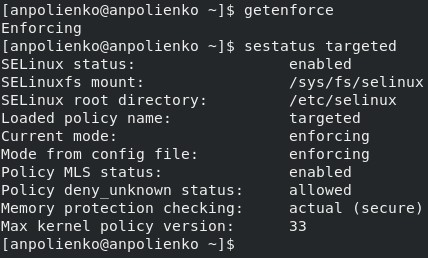
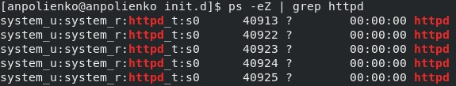
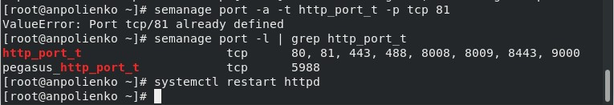

---
## Front matter
title: "Отчёт по лабораторной работе №6"
subtitle: "Дисциплина: Основы информационной безопасности"
author: "Полиенко Анастасия Николаевна, НПМбд-01-19"

## Generic otions
lang: ru-RU
toc-title: "Содержание"

## Bibliography
bibliography: bib/cite.bib
csl: pandoc/csl/gost-r-7-0-5-2008-numeric.csl

## Pdf output format
toc: true # Table of contents
toc-depth: 2
lof: true # List of figures
fontsize: 12pt
linestretch: 1.5
papersize: a4
documentclass: scrreprt
## I18n polyglossia
polyglossia-lang:
  name: russian
  options:
	- spelling=modern
	- babelshorthands=true
polyglossia-otherlangs:
  name: english
## I18n babel
babel-lang: russian
babel-otherlangs: english
## Fonts
mainfont: PT Serif
romanfont: PT Serif
sansfont: PT Sans
monofont: PT Mono
mainfontoptions: Ligatures=TeX
romanfontoptions: Ligatures=TeX
sansfontoptions: Ligatures=TeX,Scale=MatchLowercase
monofontoptions: Scale=MatchLowercase,Scale=0.9
## Biblatex
biblatex: true
biblio-style: "gost-numeric"
biblatexoptions:
  - parentracker=true
  - backend=biber
  - hyperref=auto
  - language=auto
  - autolang=other*
  - citestyle=gost-numeric
## Pandoc-crossref LaTeX customization
figureTitle: "Рис."
tableTitle: "Таблица"
listingTitle: "Листинг"
lofTitle: "Список иллюстраций"
lotTitle: "Список таблиц"
lolTitle: "Листинги"
## Misc options
indent: true
header-includes:
  - \usepackage{indentfirst}
  - \usepackage{float} # keep figures where there are in the text
  - \floatplacement{figure}{H} # keep figures where there are in the text
---

# Цель работы

Получить практические навыки адмирирования в OC Linux и ознакомиться с технологией SELinux совместно с веб-сервером Apache.

# Теоретическое введение

SELinux, или Security Enhanced Linux, --- это продвинутый механизм управления доступом, разработанный Агентством национальной безопасности (АНБ) США для предотвращения злонамеренных вторжений. Он реализует мандатную модель управления доступом (MAC --- Mandatory Access control) в дополнение к уже существующей в Linux дискреционной модели (DAC --- Discretionary Access Control), то есть разрешениям на чтение, запись, выполнение.

У SELinux есть три режима работы:

- Enforcing --- ограничение доступа в соответствии с политикой. Запрещено все, что не разрешено в явном виде. Режим по умолчанию.
- Permissive --- ведёт лог действий, нарушающих политику, которые в режиме enforcing были бы запрещены, но не запрещает сами действия.
- Disabled --- полное отключение SELinux.

В основе структуры безопасности SELinux лежат политики. Политика --- это набор правил, определяющих ограничения и права доступа для всего, что есть в системе. Под "всем" в данном случае понимаются пользователи, роли, процессы и файлы. Политика определяет связь этих категорий друг с другом.                                                                     |

Более подробно см. в [@gnu-doc:bash].

Apache --- это свободное программное обеспечение, с помощью которого можно создать веб-сервер. Несмотря на то, что Apache чаще всего называют сервером (более того, его официальное название --- Apache HTTP Server) --- это всё-таки программа, которую устанавливают на сервер, чтобы добиться определённых результатов.

Для чего нужен Apache сервер:

- чтобы открывать динамические PHP-страницы,
- для распределения поступающей на сервер нагрузки,
- для обеспечения отказоустойчивости сервера,
- чтобы потренироваться в настройке сервера и запуске PHP-скриптов.

Apache является кроссплатформенным ПО и поддерживает такие операционные системы, как Linux, BSD, MacOS, Microsoft, BeOS и другие.

Более подробно см. в [@gnu-doc-1:bash].

# Выполнение лабораторной работы

C помощью команды getenforce убеждаемся, что SELinux работает в режиме enforcing, а с помощью команды sestatus устанавливаем политику targeted (рис. [-@fig:001]).

{ #fig:001 width=70% }

Убеждаемся, что сервер работает с помощью команды service httpd status (рис. [-@fig:002]).

{ #fig:002 width=70% }

С помощью команды ps -eZ находим, что контекст безопасности Apache --- httpd_t (рис. [-@fig:003]).

{ #fig:003 width=70% }

Смотрим текущее состояние переключателей командой sestatus -b httpd (рис. [-@fig:004]).

{ #fig:004 width=70% }

Смотрим статистику по политике командой seinfo. Узнаём, что множество пользователей --- 8, ролей --- 14, типов --- 4989 (рис. [-@fig:005]).

{ #fig:005 width=70% }

Определяем тип файлов и круг пользователей с правой на создание и поддиректорий в директориях /var/www и /var/www/html командой ls -lZ (рис. [-@fig:006]).

{ #fig:006 width=70% }

От имени суперпользователя создаём файл /var/www/html/test.html (рис. [-@fig:007]).

{ #fig:007 width=70% }

Командой matchpathcon узнаём контекст файла test.html и директории /var/www/html --- это httpd_sys_content_t (риc. [-#fig:008]).

{ #fig:008 width=70% }

Обращаемся к файлу через ссылку в веб-браузере. Контент отображён корректно (рис. [-@fig:009]).

{ #fig:009 width=70% }

Изучая справку man httpd_selunix узнаём, что для httpd определены следующие контексты: httpd_sys_content_t, httpd_sys_script_exec_t, httpd_sys_script_ro_t, httpd_sys_script_rw_t, httpd_sys_script_ra_t, httpd_unconfined_script_exec_t. Меняем контекст файла test.html командой chcon -t (рис. [-@fig:010]).

{ #fig:010 width=70% }

При повторной попытке открыть файл через веб-браузер получаем ошибку доступа (рис. [-@fig:011]).

{ #fig:011 width=70% }

Убеждаемся, что файл доступен для чтения всем пользователям командой ls -l. Далее смотрим log-файлы веб-сервера Apache командой tail, где показаны ошибки (рис. [-@fig:012]).

{ #fig:012 width=70% }

Устанавливаем веб-сервер Apache на прослушивание TCP-порта 81, изменяя строку Listen в файле /etc/httpd/conf/httpd.conf (рис. [-@fig:013]).

{ #fig:013 width=70% }

Перезапускаем сервер и смотри данные log-файлов веб-сервера Apache (рис. [-@fig:014]).

{ #fig:014 width=70% }

Устанавлием для веб-сервера Apache порт TCP-81 и проверяем его наличие в списке портов командой semanage (рис. [-@fig:015]).

{ #fig:015 width=70% }

Возвращаем файлу test.html контекст httpd_sys_content_t и снова успешно просматриваем страницу в веб-браузере (рис. [-@fig:016]).

{ #fig:016 width=70% }

Возвращаем в конфигурационный файл прослушивание порта 80 и удаляем порт 81 из списка портов (рис. [-@fig:017]).

{ #fig:017 width=70% }

Удаляем файл test.html (рис. [-@fig:018]).

{ #fig:018 width=70% }

# Выводы

Я получила основные навыки администрирования в OC Linux и проверила работу SELinux на практике совместно с веб-сервером Apache.

# Список литературы{.unnumbered}

::: {#refs}
:::
