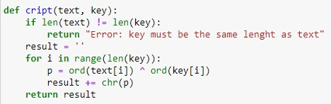
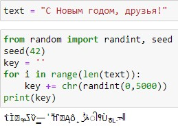
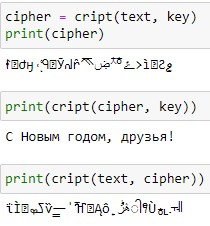

---
## Front matter
lang: ru-RU
title: Лабораторная работа №7
subtitle: Основы информационной безопасности
author:
  - Полиенко Анастасия Николаевна
institute:
  - Российский университет дружбы народов, Москва, Россия
  - НПМбд-01-19
date: 18 сентября 2022

## i18n babel
babel-lang: russian
babel-otherlangs: english

## Formatting pdf
toc: false
toc-title: Содержание
slide_level: 2
aspectratio: 169
section-titles: true
theme: metropolis
header-includes:
 - \metroset{progressbar=frametitle,sectionpage=progressbar,numbering=fraction}
 - '\makeatletter'
 - '\beamer@ignorenonframefalse'
 - '\makeatother'
---

# Элементы криптографии. Однократное гаммирование

## Цель лабораторной работы

- Получить практические навыки по работе с однократным гаммированием

## Задачи лабораторной работы

- Написать функцию шифровки и дешифровки данных в режиме однократного гаммирования
- Определить вид шифротекста при известном ключе и открытом тексте
- Определить ключ, преобразующий шифротекст в один из вариантов прочтения открытого текста

# Ход лабораторной работы

## Теоретическое введение

Гаммирование представляет собой наложение (снятие) на открытые (зашифрованные) данные последовательности элементов других данных, полученной с помощью некоторого криптографического алгоритма, для получения зашифрованных (открытых) данных. Иными словами, наложение
гаммы — это сложение её элементов с элементами открытого (закрытого)
текста по некоторому фиксированному модулю, значение которого представляет собой известную часть алгоритма шифрования.

## Функция шифрования

Создаём функцию, которая осуществляет однократное гаммирование посредством побитового XOR

## Исходные данные

Задаём текстовую строку и создаём случайный символьный ключ такой же длины

## Результат работы программы

- Запускаем функцию. В первом случае получаем зашифрованный текст. 
- Далее, используя тот же самый ключ, осущвляем дешифровку текста.
- Так же, зная оригинальный текст и его шифорку, можем получить ключ.

## Выводы

- Освоено на практике применение режима однократного гаммирования