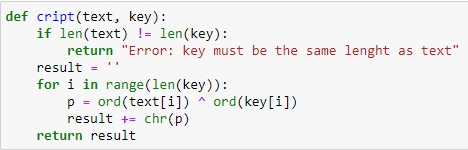
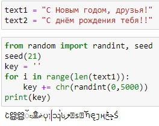
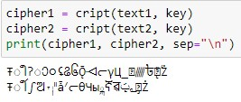
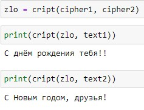
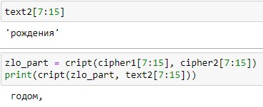

---
## Front matter
lang: ru-RU
title: Лабораторная работа №8
subtitle: Основы информационной безопасности
author:
  - Полиенко Анастасия Николаевна
institute:
  - Российский университет дружбы народов, Москва, Россия
  - НПМбд-01-19
date: 19 октября 2022

## i18n babel
babel-lang: russian
babel-otherlangs: english

## Formatting pdf
toc: false
toc-title: Содержание
slide_level: 2
aspectratio: 169
section-titles: true
theme: metropolis
header-includes:
 - \metroset{progressbar=frametitle,sectionpage=progressbar,numbering=fraction}
 - '\makeatletter'
 - '\beamer@ignorenonframefalse'
 - '\makeatother'
---

# Элементы криптографии. Шифрование (кодирование) различных исходных текстов одним ключом

## Цель лабораторной работы

- Освоить на практике применение однократного гаммирования при работе с различными текстами на одном ключе.

## Задачи лабораторной работы

- Написать функцию, осуществляющую однократное гаммирование
- Защифровать два исходных текста
- Определить способ, при котором злоумышленник может получить данные, не зная ключа

# Ход лабораторной работы

## Теоретическое введение

Гаммирование представляет собой наложение (снятие) на открытые (зашифрованные) данные последовательности элементов других данных, полученной с помощью некоторого криптографического алгоритма, для получения зашифрованных (открытых) данных. Иными словами, наложение
гаммы — это сложение её элементов с элементами открытого (закрытого)
текста по некоторому фиксированному модулю, значение которого представляет собой известную часть алгоритма шифрования.

## Функция шифрования

Cоздаём функцию, которая осуществляет однократное гаммирование посредством побитового XOR

## Исходные данные

Задаём две равные по длине текстовые строки и создаём случайный символьный ключ такой же длины

## Шифрование данных

Осуществляем шифрование двух текстов по ключу с помощью написанной функции

## Получение данных без ключа

Создаём переменную, которая, прогнав два шифрованных текста через побитовый XOR, поможет злоумышленнику
получить один текст, зная другой, без ключа 

## Получение части данных

Таким же способом можно получить часть данных 

## Выводы

- Освоено на практике применение режима однократного гаммирования
- Изучены недостатки однократного гаммирования
